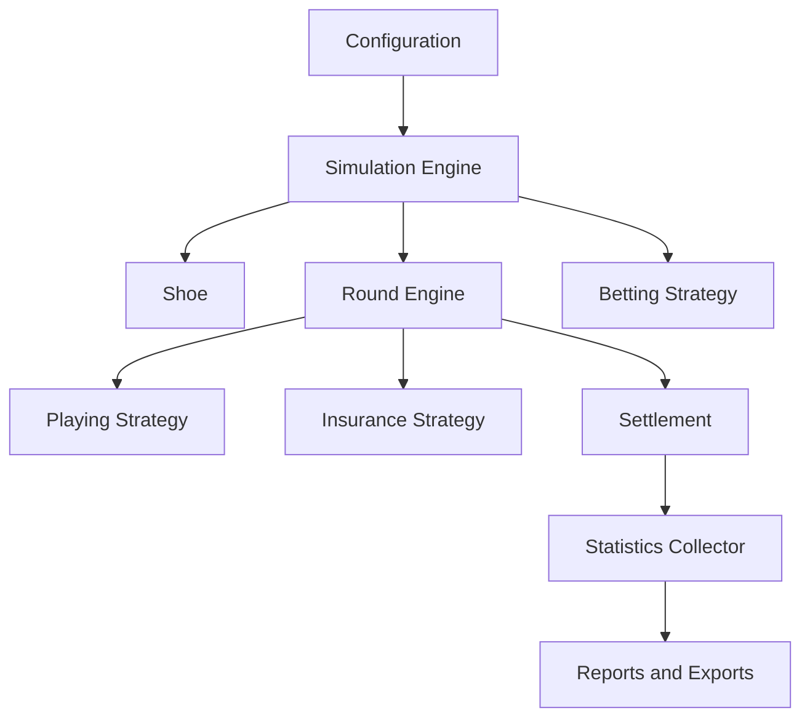

# Architecture

This document describes the planned architecture. The current codebase contains
only the project foundation.

## Module Diagram

## Dependency Model

Domain modules must not depend on CLI, presentation, filesystem formats, or a
future web API. Configuration loading should create typed configuration objects
and pass them into the engine.

Planned layers:

- `cards`, `hand`, `shoe`, and `rules`: core domain objects.
- `round`, `settlement`, and `engine`: game flow and simulation orchestration.
- `strategies`, `betting`, and `counting`: replaceable decision components.
- `statistics` and `output`: reporting without changing domain behavior.
- `cli`: user-facing command line wrapper around the engine.

## Single Round Flow

1. Betting strategy chooses the initial wager.
2. Shoe deals initial player and dealer cards according to the table model.
3. Insurance and peek rules are evaluated when applicable.
4. Player hands are played through the selected strategy.
5. Dealer completes the hand according to S17/H17 and hole-card rules.
6. Settlement computes net results for each hand and side bet.
7. Statistics are updated once per round with hand-level detail.
8. Shoe penetration is checked before the next round.

## Basic Strategy Selection

Basic strategy will be selected from a profile keyed by relevant table rules:
dealer S17/H17, double rules, surrender availability, DAS, split rules, and
blackjack payout where it changes expected decisions.

Strategies must return legal fallback actions when a preferred action is not
available under the active rules.

## Bankroll Settlement

Settlement records net profit or loss separately from returned stake. Splits,
doubles, surrender, insurance, and ENHC variants must be represented explicitly
so statistics can distinguish initial wager from total action.

## Statistics

Statistics should be streaming and mergeable. Large simulations must not require
storing every round. Planned metrics include net result, RTP, house edge,
standard deviation, confidence intervals, drawdown, streaks, and bankroll
history sampling.

## Extending Strategies

New betting or insurance strategies should implement a small interface and be
constructed by a factory from typed configuration. Strategy state must be scoped
to a simulation run and updated once per completed round unless documented
otherwise.

## Adding Table Rules

New rules should be added to the typed rules configuration, documented in
`docs/rules.md` when introduced, and covered by unit or integration tests before
being used by strategy tables.
