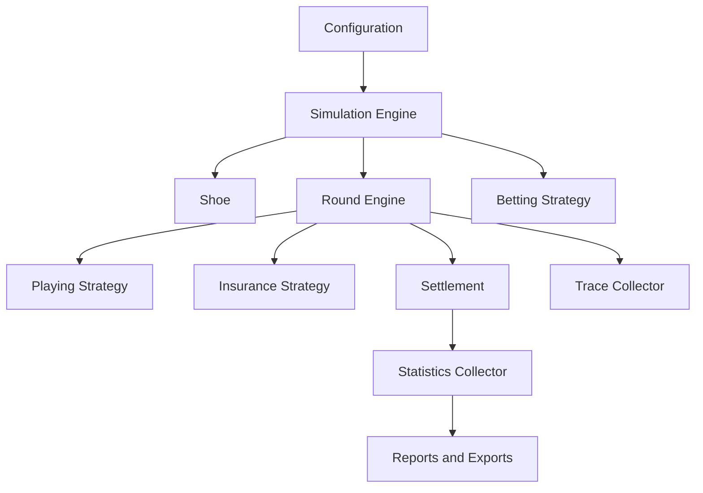

# Architecture

This document describes the MVP architecture. The codebase separates blackjack
domain behavior, strategy selection, betting systems, configuration, reporting,
CLI orchestration, and deterministic worker execution.

## Module Diagram

## Dependency Model

Domain modules must not depend on CLI, presentation, filesystem formats, or a
future web API. Configuration loading should create typed configuration objects
and pass them into the engine.

Layers:

- `cards`, `hand`, `shoe`, and `rules`: core domain objects.
- `round`, `settlement`, and `engine`: game flow and simulation orchestration.
- `strategies`, `betting`, and `counting`: replaceable decision components.
- `statistics` and `output`: reporting without changing domain behavior.
- `trace`: optional structured event collection for replay and diagnostics.
- `cli`: user-facing command line wrapper around the engine.

## Single Round Flow

1. Betting strategy chooses the initial wager.
2. Shoe deals initial player and dealer cards according to the table model.
3. Insurance and peek rules are evaluated when applicable.
4. Player hands are played through the selected strategy.
5. Dealer completes the hand according to S17/H17 and hole-card rules.
6. Settlement computes net results for each hand and side bet.
7. Statistics are updated once per round with hand-level detail.
8. Shoe penetration is checked before the next round.

When a `TraceCollector` is supplied, the engine and round flow emit ordered
events for round start/end, initial bet placement, card deals, strategy
requests/resolution, player actions, hand settlement, insurance settlement, and
shoe shuffle. Without a collector, no trace events are built.

## Basic Strategy Selection

Basic strategy is selected from a profile keyed by dealer S17/H17 behavior.
The round engine passes legal actions for the active table rules, and the
strategy maps preferred table decisions through those legal actions.

Strategies must return legal fallback actions when a preferred action is not
available under the active rules.

The implementation provides S17 and H17 table profiles. Tables can prefer hit,
stand, double, split, or surrender-shaped decisions; illegal preferred actions
fall back to legal hit/stand behavior.

## Bankroll Settlement

Settlement records net profit or loss separately from returned stake. Splits,
doubles, surrender, insurance, and ENHC variants are represented explicitly so
statistics can distinguish initial wager from total action. Blackjack pays the
configured profit multiplier, normal wins pay even money, losses are negative
current bet, and pushes are zero.

## Statistics

Statistics are streaming and mergeable. Large report-only simulations can run
without storing every round result. Metrics include net result, average round
result, variance, RTP, house edge, drawdown, and streaks.

## Worker Execution

`run_worker_simulations` splits rounds deterministically, derives one seed per
worker from the top-level seed, creates independent shoe and strategy instances,
and merges worker collectors in worker-index order. Completion order from
processes does not affect the aggregate report.

## Extending Strategies

New betting or insurance strategies should implement a small interface and be
constructed by a factory from typed configuration. Strategy state must be scoped
to a simulation run and updated once per completed round unless documented
otherwise.

## Adding Table Rules

New rules should be added to the typed rules configuration, documented in
`docs/rules.md` when introduced, and covered by unit or integration tests before
being used by strategy tables.
